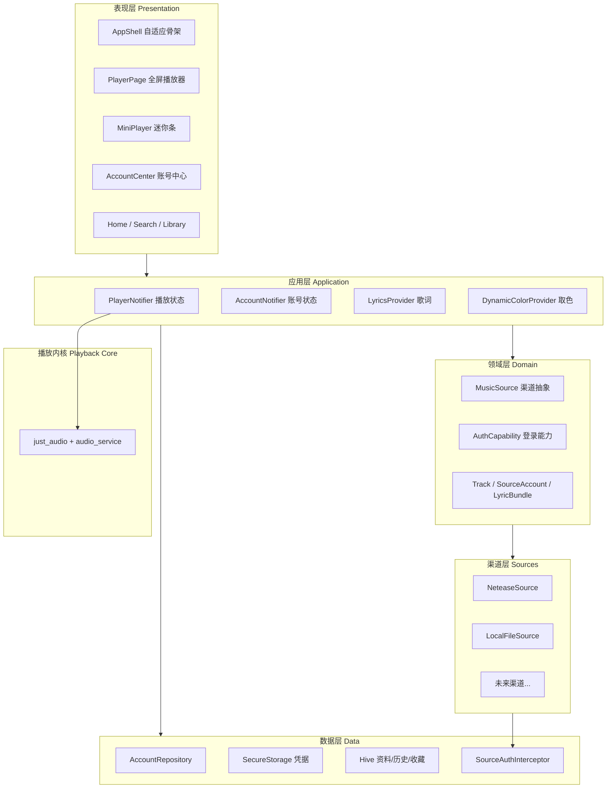

# Musaic 项目总体计划（Master Plan）

> **Musaic** = Music + Mosaic —— 汇聚多方音源的音乐拼图
> 多渠道音乐播放器（Flutter）· 项目总纲文档
>
> 架构灵感：PicaComic（多源插件化、按源独立账号）
> 体验灵感：Mei（Apple Music 风格、逐字歌词、流体玻璃）
>
> 版本：v1.0 ｜ 日期：2026-08-25 ｜ 状态：可实施

---

## 文档族说明

本计划由三份文档组成，本文档为总纲：

| 文档 | 定位 | 内容 |
|---|---|---|
| **本文档（Master Plan）** | 总纲 | 愿景、架构、模块划分、统一路线图、发布计划、风险 |
| 《Musaic 账号系统设计方案》 | 实施细则 | 账号/登录全部领域模型、存储层、状态层、登录 UI、网易云登录的完整代码 |
| 《Musaic 前端设计方案》 | 实施细则 | 设计系统、导航骨架、PlayerNotifier、MiniPlayer/PlayerPage/逐字歌词的完整代码 |

> 实施时：按本文档路线图推进；写代码时：打开对应细则文档复制骨架。

---

## 目录

1. 项目愿景与定位
2. 参考项目融合策略
3. 总体架构
4. 核心领域模型总览
5. 子系统一：多渠道系统
6. 子系统二：账号系统
7. 子系统三：播放内核
8. 子系统四：前端 UI 系统
9. 子系统五：存储与同步
10. 横切关注点（安全 / 性能 / 平台）
11. 统一目录结构
12. 统一依赖清单
13. 总体开发路线图（P0–P7）
14. 里程碑验收与完成定义
15. 测试策略总览
16. 发布计划
17. 风险登记册
18. 版本演进路线（V1.1 → V2.0）

---

## 1. 项目愿景与定位

### 1.1 一句话定义

Musaic 是一个**跨平台、多渠道、沉浸式**的开源音乐播放器：像 PicaComic 聚合漫画源一样聚合音乐渠道，像 Mei 一样提供 Apple Music 级别的播放体验。

### 1.2 核心卖点

| 卖点 | 说明 |
|---|---|
| 多渠道聚合 | 统一搜索/播放/收藏多个音乐来源（网易云、本地文件、可扩展渠道），渠道可插拔 |
| 按渠道账号 | 每个渠道独立登录、独立凭据、独立状态（PicaComic 模式） |
| 沉浸式体验 | 逐字歌词、封面取色动态背景、流体玻璃（Mei 模式） |
| 跨平台 | Android / iOS / macOS / Windows 一套代码 |
| 低内存 | 播放中常驻内存目标 < 150MB，模糊与图片解码严格预算 |

### 1.3 非目标（V1 明确不做）

- 不做音乐下载的版权规避工具（仅播放渠道允许的流）
- 不做社交功能（评论、动态）
- 不做服务端（纯客户端 + 渠道官方 API）
- Web 端仅技术验证，不作为发布目标（安全存储在 Web 无可靠方案）

---

## 2. 参考项目融合策略

| 维度 | PicaComic（架构来源） | Mei（体验来源） | Musaic 落地方案 |
|---|---|---|---|
| 多源机制 | `lib/sources` 多源实现、统一接口、自定义源 | — | `MusicSource` 抽象 + `SourceRegistry` 注册中心 |
| 账号体系 | 按源独立登录（密码/Cookie/免登录） | MUSIC_U 纯值 Cookie 登录 | 渠道声明式 `AuthCapability`，UI 动态生成表单 |
| 凭据存储 | 本地持久化 | 本地持久化 | `flutter_secure_storage`（凭据）+ Hive（资料） |
| 歌词 | — | 逐字歌词（官方/第三方/TTML 三来源） | `flutter_lyric` + TTML 解析，三级降级 |
| 视觉 | 多平台列表/详情 | 流体玻璃、动态背景、个人中心 | 设计令牌 + 受控模糊 + 封面取色 |
| 数据同步 | WebDAV 同步收藏/历史 | 本地历史/喜欢 | V1.3 接入 WebDAV（凭据不同步） |
| 平台 | Android/iOS/Win/macOS/Linux | Android | Android/iOS/macOS/Windows |

---

## 3. 总体架构

### 3.1 分层架构图



### 3.2 模块依赖规则（强制）

1. 表现层只依赖应用层；应用层只依赖领域层与数据层接口。
2. **UI 永不直接 import 渠道实现**——一切经 `SourceRegistry` 解析。
3. 渠道实现只依赖领域层，不依赖 UI。
4. 凭据只能经 `AccountRepository` 进出安全存储，禁止散落读写。

### 3.3 关键数据流

- **播放流**：UI 点歌 → `PlayerNotifier.playQueue` → `SourceRegistry.get(track.sourceId)` → `source.getStreamUrl` → `just_audio` 播放 → 进度流驱动进度条与逐字歌词。
- **登录流**：账号中心 → 渠道声明字段 → 动态表单 → `source.login` 验证 → 凭据入安全存储 / 资料入 Hive → 状态广播。
- **歌词流**：切歌 → `lyricsProvider(track)` → 渠道 `getLyrics`（官方逐字 > TTML > LRC 降级）→ `flutter_lyric` 渲染。

---

## 4. 核心领域模型总览

| 模型 | 归属 | 职责 | 详细定义 |
|---|---|---|---|
| `Track` | core/model | 统一曲目（携带 `sourceId` 渠道身份） | 前端文档 §6.1 |
| `MusicSource` | core/source | 渠道抽象（搜索/详情/播放地址/歌词/账号能力） | 账号文档 §5.1 |
| `SourceRegistry` | core/source | 渠道注册与解析 | 账号文档 §5.2 |
| `AuthCapability` | auth/domain | 渠道登录能力声明（Cookie/密码/Token/免登录） | 账号文档 §4.3 |
| `CredentialField` | auth/domain | 登录表单字段声明（驱动动态表单） | 账号文档 §4.2 |
| `SourceAccount` | auth/domain | 渠道账号状态与资料 | 账号文档 §4.4 |
| `AuthResult` | auth/domain | 登录结果（成功/失败分类） | 账号文档 §4.5 |
| `LyricBundle` | lyrics/domain | 统一歌词（格式/逐字标记/翻译） | 前端文档 §8.2 |
| `PlayerState` | player/application | 播放状态（队列/进度/模式） | 前端文档 §6.2 |

---

## 5. 子系统一：多渠道系统

### 5.1 职责

- 定义 `MusicSource` 抽象：音乐能力（搜索/详情/播放地址/歌词）+ 账号能力（登录/登出/会话校验）。
- `SourceRegistry` 统一注册与按 `sourceId` 解析。
- 每个渠道独立的 Dio 实例 + `SourceAuthInterceptor`（请求注入凭据、401 捕获上报过期）。

### 5.2 V1 渠道清单

| 渠道 | id | 登录方式 | 能力 |
|---|---|---|---|
| 网易云音乐 | `netease` | Cookie（MUSIC_U 纯值，含输入清洗与内嵌获取指引） | 搜索、播放、歌单、逐字歌词 |
| 本地文件 | `local` | 免登录（`NoAuth`） | 扫描本地目录、内嵌标签/封面读取 |

### 5.3 扩展规范

新渠道 = 新建 `lib/sources/<id>/` + 实现 `MusicSource` + 在 `sourceRegistryProvider` 注册一行。UI 零改动（动态表单与渠道徽章自动适配）。

---

## 6. 子系统二：账号系统

> 完整代码见《Musaic 账号系统设计方案》，此处为要点。

- **按渠道独立账号**：`SourceAccount`（loggedOut / loggedIn / expired 三态状态机）。
- **声明式登录**：渠道通过 `AuthCapability` 声明登录方式与表单字段，登录弹窗动态渲染，内嵌「如何获取 MUSIC_U」图文指引。
- **存储分层**：凭据 → `flutter_secure_storage`（Keychain/Keystore/DPAPI）；资料与状态 → Hive。
- **生命周期**：启动乐观恢复缓存状态 → 后台异步校验 → 失效标记过期；请求 401/302 被动捕获同样标记过期；过期不删凭据，引导重新登录。
- **安全清单**：日志脱敏、输入清洗、macOS Keychain Sharing、Web 端降级提示、一键清除所有账号数据。

---

## 7. 子系统三：播放内核

| 项 | 方案 |
|---|---|
| 解码播放 | `just_audio`（跨平台统一） |
| 后台与系统控制 | `audio_service`（通知栏/锁屏/耳机按键），`audio_session` 处理打断 |
| 桌面系统集成 | Windows SMTC；macOS Now Playing |
| 队列与模式 | `PlayerNotifier`：顺序/随机/单曲循环，「上一首超 3 秒先回开头」 |
| 定时关闭 | `PlayerNotifier.setSleepTimer`（对齐 Mei 的定时播放） |
| 播放地址解析 | 每次播放经渠道 `getStreamUrl` 实时解析，不缓存过期 URL |

---

## 8. 子系统四：前端 UI 系统

> 完整代码见《Musaic 前端设计方案》，此处为要点。

- **设计系统**：`AppTokens` 令牌（Apple Music 红渐变、24/28 圆角、受控模糊、动效曲线），深色优先。
- **自适应骨架**：`go_router` + `StatefulShellRoute` 四 Tab（首页/搜索/资料库/账号），840dp 断点切换底部导航 ↔ NavigationRail；MiniPlayer 悬浮层常驻。
- **全屏播放器**：封面取色动态渐变背景（`palette_generator_master`）、Hero 封面、下滑手势关闭、拖拽加粗进度条。
- **逐字歌词**：`flutter_lyric` 渲染 + 进度流驱动 + 点击行跳转；TTML 自研解析，三级降级。
- **性能预算**：每屏最多 1 个实时 `BackdropFilter`，播放页背景用静态模糊图，低端机可关玻璃效果；图片按显示尺寸解码；进度流 100ms 节流。

---

## 9. 子系统五：存储与同步

| 数据 | 存储 | 说明 |
|---|---|---|
| 凭据（Cookie/Token） | flutter_secure_storage | 永不明文落盘、永不同步 |
| 账号资料/状态 | Hive `account_box` | 启动恢复用 |
| 喜欢/歌单/历史 | Hive / sqflite | 本地优先 |
| 封面缓存 | cached_network_image | 按尺寸解码 |
| 同步（V1.3） | WebDAV | 借鉴 PicaComic：同步收藏/历史/设置，**不同步凭据** |

---

## 10. 横切关注点

### 10.1 安全（继承账号文档清单）

凭据只进安全存储；日志全局脱敏（过滤 Cookie/Authorization）；输入清洗；强制 HTTPS；一键清除账号数据。

### 10.2 性能预算（硬性）

- 移动端播放中常驻内存 < 150MB；中端 Android 机 60fps。
- 每屏 ≤ 1 个实时模糊区；模糊区外套 `RepaintBoundary`。
- 未启用渠道不实例化网络客户端（懒加载）。

### 10.3 平台适配

| 平台 | 关键事项 |
|---|---|
| Android | 媒体通知、玻璃效果降级开关 |
| iOS | audio_session 配置、钥匙串 |
| macOS | 自定义标题栏 + **Keychain Sharing capability（必须，否则安全存储失败）** |
| Windows | 最小窗口 960×640、SMTC |

---

## 11. 统一目录结构

```
lib/
├── app/
│   ├── app_shell.dart               # 自适应骨架（导航 + MiniPlayer 悬浮层）
│   └── router.dart                  # go_router 路由表
├── core/
│   ├── theme/app_tokens.dart        # 设计令牌
│   ├── model/track.dart             # 统一曲目模型
│   ├── source/                      # MusicSource 抽象 + SourceRegistry
│   └── network/                     # SourceAuthInterceptor
├── features/
│   ├── auth/                        # 账号系统（domain/data/application/presentation）
│   ├── player/                      # 播放（PlayerNotifier + MiniPlayer/PlayerPage/widgets）
│   ├── lyrics/                      # 歌词（LyricBundle/TTML 解析/Provider）
│   ├── theme/                       # 动态取色
│   ├── home/                        # 首页：推荐 + 最近播放
│   ├── search/                      # 多渠道聚合搜索
│   └── library/                     # 歌单/喜欢/历史
└── sources/
    ├── netease/                     # 网易云渠道
    └── local/                       # 本地文件渠道
```

---

## 12. 统一依赖清单（pubspec.yaml）

```yaml
dependencies:
  flutter:
    sdk: flutter

  # 状态与架构
  flutter_riverpod: ^2.5.1
  go_router: ^14.0.0

  # 网络
  dio: ^5.7.0
  cookie_jar: ^4.0.8
  dio_cookie_manager: ^3.1.1

  # 存储
  flutter_secure_storage: ^9.2.2
  hive: ^2.2.3
  hive_flutter: ^1.1.0
  path_provider: ^2.1.4

  # 播放
  just_audio: ^0.9.42
  audio_service: ^0.18.15
  audio_session: ^0.1.21

  # UI 与体验
  flutter_lyric: ^3.0.0                  # 逐字歌词
  palette_generator_master: ^1.0.1       # 封面取色
  cached_network_image: ^3.4.0           # 图片缓存
  liquid_glass_container_plus: ^1.0.4    # 装饰性玻璃（小面积）
  window_manager: ^0.4.0                 # 桌面窗口
  xml: ^6.5.0                            # TTML 解析

dev_dependencies:
  flutter_test:
    sdk: flutter
  mocktail: ^1.0.4
  golden_toolkit: ^0.15.0                # 黄金测试
```

> 版本以 `flutter pub get` 实际解析为准，`pubspec.lock` 提交入库。

---

## 13. 总体开发路线图（P0–P7）

> 将账号文档的 M1–M6 与前端文档的 F1–F6 合并为可执行的 10 周路线。
> 原则：**先能听歌，再能登录，再变好看**——每个阶段结束都有可运行的 App。

### P0 地基（第 1 周）

- 任务：工程初始化、`AppTokens` 设计令牌、核心模型（`Track`）、CI（GitHub Actions 构建 Android/Windows/macOS）、`flutter analyze` 零警告基线。
- 验收：四平台空壳 App 跑通，CI 绿。

### P1 播放核心（第 2 周）

- 任务：`PlayerNotifier` + `LocalFileSource`（免登录）+ `MiniPlayer` + AppShell/路由骨架。
- 对应细则：前端文档 §4、§6、§7.1。
- 验收：扫描本地音乐可播放，迷你条控制可用，四 Tab 切换正常。**（第一个能听歌的版本）**

### P2 多渠道骨架（第 3 周）

- 任务：`MusicSource` 抽象 + `SourceRegistry` + `NeteaseSource` 匿名能力（搜索/播放地址/详情）。
- 对应细则：账号文档 §5；本文档 §5。
- 验收：网易云搜索出歌、点击可播放；本地与网易云在 UI 上无差别渲染。

### P3 账号系统（第 4–5 周）

- 任务：账号领域层 → 存储层 → `AccountNotifier` → 账号中心 + 登录弹窗 → 启动恢复/过期检测/401 拦截。
- 对应细则：账号文档 §4–§10（全部）。
- 验收：MUSIC_U 登录成功显示昵称头像；改坏 Cookie 重启后 3s 内标记「已过期」；杀进程重开状态 200ms 内恢复。
- **联调点**：登录态打通歌单与歌词接口。

### P4 沉浸式播放器（第 5–6 周）

- 任务：`PlayerPage`（取色背景/Hero/手势）+ 进度条 + 控制区 + 播放模式。
- 对应细则：前端文档 §7.2–§7.3、§9。
- 验收：Hero 无跳变、下滑关闭跟手、切歌背景 450ms 渐变。

### P5 逐字歌词（第 6–7 周）

- 任务：TTML 解析器 + `LyricsView` + 三级降级（官方逐字 > TTML > LRC）。
- 对应细则：前端文档 §8。
- 验收：逐字高亮误差 < 50ms；点击行跳转；无逐字降级逐行不报错。

### P6 内容页面（第 7–8 周）

- 任务：HomePage（推荐/最近播放）、SearchPage（多渠道聚合分组）、LibraryPage（喜欢/歌单/历史）、PlaylistDetailPage。
- 验收：搜索→点歌→播放→歌词→收藏全链路通。

### P7 打磨与发布（第 9–10 周）

- 任务：性能达标（内存/帧率）、平台适配（桌面窗口/快捷键/媒体键）、测试补齐、文档与 README、Beta 打包。
- 验收：本文档 §14 全部 DoD 通过。

---

## 14. 里程碑验收与完成定义（DoD）

每个阶段关闭前必须满足：

1. 功能验收标准通过（见各阶段）。
2. `flutter analyze` 零警告；新增代码有对应单元/Widget 测试。
3. 性能预算不破：内存、帧率、模糊区域数达标。
4. 四平台中至少 Android + 一个桌面平台真机验证。
5. 文档同步更新（README / 细则文档）。

---

## 15. 测试策略总览

| 层 | 范围 | 工具 |
|---|---|---|
| 单元 | 模型序列化、输入清洗、队列逻辑、TTML 解析、存储命名空间隔离 | flutter_test + mocktail |
| Widget | 登录弹窗动态表单、MiniPlayer 状态、播放控制区、进度条拖拽 | flutter_test |
| 黄金 | 深色/浅色下 PlayerPage、MiniPlayer、账号中心快照 | golden_toolkit |
| 集成 | mock 渠道跑全链路：登录→搜索→播放→歌词→过期 | integration_test |

---

## 16. 发布计划

| 阶段 | 时间 | 内容 |
|---|---|---|
| Alpha（自用） | P5 结束 | 本机侧载/自签，验证核心体验 |
| Beta（公开测试） | P7 结束 | GitHub Releases 发布 Android APK / Windows zip / macOS dmg，附已知问题列表 |
| V1.0 | Beta 反馈修复后 | 全平台正式包 + README + 截图 + 安装指引 |
| 版本策略 | 持续 | SemVer；渠道 API 变更走 hotfix（patch 版本） |
| CI/CD | 全程 | GitHub Actions：PR 检查（analyze+test），tag 触发四平台构建 |

---

## 17. 风险登记册

| 风险 | 概率 | 影响 | 对策 |
|---|---|---|---|
| 网易云 API 变动/风控升级 | 高 | 渠道失效 | 渠道层隔离，失效只影响单渠道；hotfix 发版机制；关注上游 API 项目动态 |
| Flutter Android 大面积模糊性能差 | 已知 | 掉帧 | 性能预算（每屏 1 个实时模糊）+ 静态模糊背景 + 低端机降级开关 |
| TTML 解析复杂度超预期 | 中 | 歌词延期 | `flutter_lyric` 承担渲染，解析器只做转换；LRC 降级保底 |
| macOS 钥匙串配置坑 | 中 | 登录无法持久化 | P3 第一周先真机验证 Keychain Sharing，再写业务 |
| 单人开发节奏失控 | 中 | 延期 | 阶段可裁剪：P6 内容页可从简，P5 歌词可先逐行后逐字 |
| 版权合规 | 低 | 下架风险 | 仅接入渠道官方 API，不破解不缓存受限内容，README 加免责声明 |

---

## 18. 版本演进路线

| 版本 | 内容 |
|---|---|
| V1.0 | 本文档全部范围：网易云 + 本地、账号系统、逐字歌词、沉浸播放器 |
| V1.1 | 网易云扫码登录（`AuthType.qr` 预留）、定时关闭 UI 完善 |
| V1.2 | 新渠道（QQ 音乐 / Subsonic / Jellyfin，密码或 Token 登录，`PasswordAuth`/`TokenAuth` 已就绪） |
| V1.3 | WebDAV 同步收藏/历史/设置（借鉴 PicaComic，凭据不同步） |
| V1.4 | 同渠道多账号切换（`SourceAccount` 增加 accountSlot） |
| V2.0 | 自定义渠道（借鉴 PicaComic 3.0 自定义源：声明式配置接入新渠道） |

---

*总纲结束。开始 P0 之前，建议把三份文档放入仓库 `docs/` 目录，路线图的每个阶段对应一个 GitHub Milestone。*
